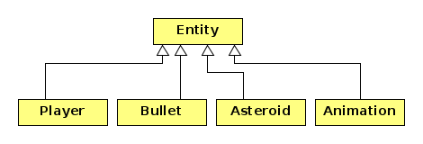

# SFML transformacije i iscrtavanje

U ovom repozitoriju nalazi se polazni kod za druge vježbe iz SFML-a. Na stranici kolegija, na Merlinu, 
nalaze se video datoteke u kojima su opisani elementi programa iz
repozitorij. Radi se o klasi `TextureHolder`, `Entity` i `Animation` te klasi `Game` 
koja je uvedena u prvim SFML vježbama. Datotekame su  `sfml-5a.mp4` i `sfml-5b.mp4`
(`TextureHolder` klasa), `sfml-6.mp4` (o transformacijama), `sfml-7.mp4` (`Entity` klasa) i 
`sfml-8.mp4` (o animaciji). 

O kodu se informacije  mogu naći u dokumentima [doc/SFMLintro.html](doc/SFMLintro.html) i
[doc/iscrtvanje.html](doc/iscrtavanje.html).

Vaš sljedeći **zadatak** se sastoji u sljedećem:

Treba dopuniti klase koje naljeđuju `Entity` klasu na ovaj način:

Klasa `Asteroid` predstavlja asteroid koji se giba slučajno odabranom brzinom i rotira 
određenom kutnom brzinom. Gibanje se vrši po torusu, odnosno kada asteroid izađe iz prozora 
kroz jednu stranicu vraća se u prozor kroz suprotnu stranicu na istoj koordinati. 
U početnom trenutku 4 asteroida se pojavljuje na slučajno odabranim koordinata unutar prozora i 
započinju svoje gibanje iz tih točaka. 

Klasa `Player` predstavlja svmirski brod koji se u početnom trenutku nalazi u centru prozora.
On reagira na strelice. Lijeva i desna strelica ga rotiraju na lijevo i na desno. Gornja strelica 
ubrzava brod, a donja usporava. Brzine rotacije i ubrzavanje/usporavanje skalirajte prema svom
nahođenju. Svemirski brod isto tako kreće po torusu. Pritiskom na razmaknicu svemirski brod 
ispaljuje metak (_bullet_) u smjeru svoje osi pred sebe.

Klasa `Bullet` predstavlja metak koji ispucava brod. Metak se kreće brzo i kada napušta ekran 
nestaje. On se ne giba po torusu!

Klasa `Animacija` predstavlja animaciju i ovdje će biti korištena za eksplozije. Najvećim dijelom je 
već napravljena. 

U ovom koraku ne pravimo cjelokupnu igru, no treba imati na umu da će u igri trebati detektirati 
kolizije metka i asteroida te asteroida i svemirskog broda te će se na tim mjestima desiti 
eksplozije. Taj dio ne radimo u ovom koraku.

U početku simulacije treba rasporediti 4 asteroida na slučajne pozicije, dati im slučajne brzine 
i neku rotaciju te ih pustiti da se kreću. Svemirski brod je u početnom trenutku u centru 
prozora. Važno je pri tome da svemirski brod reagira na naredbe i da ispaljuje metke u pravom smjeru. 

Kako igra treba izgledati može se vidjeti na kratkoj animaciji `zadatak-sfml2.mp4` na stranici kolegija 
na Merlinu.  

Za generiranje slučajnih brojeva možete koristiti C-funkcije `srand` i `rand` (zaglavlje `<cstdlib>`),
što je jednostavnija opcija, il možete koristiti klase iz zaglavlja `<random>`. 
