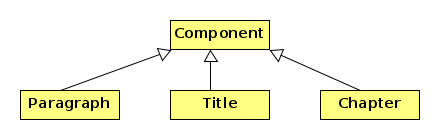

# Zadatak

Dokument je zadan u _asciidoc_ formatu. Potrebno ga je pročitati iz datoteke 
i spremiti u strukturu stabla koristeći **Composite**  oblikovni obrazac. Zatim treba 
konvertirati asciidoc format u html format koristeći  **Visitor** oblikovni obrazac.

**Priprema**. Proučiti slideove s predavanja koji se odnose na oblikovne obrasce 
*Composite*, *Visitor* i *Iterator*. 

## Asciidoc 

Asciidoc  format  je vrlo jednostavan format dokumenta koji se pomoću programa `asciidoc`
može konvertirati u pdf, html i druge formate. Formatiranje teksta u asciidoc-u je vrlo jednostavno. 
Kada riječ  želimo ispisati podebljano stavljamo  je između zvjezdica (bez razmaka). Kada je želimo 
ispisati u kurzivu okružujemo je podvlakama. Naslov dokumenta dolazi nakon znaka jednakosti 
koji se nalazi u prvoj koloni. Naslov poglavlja dolazi nakon dvostrukog znaka jednakosti (==)  s početkom
u prvoj koloni. Na primjer,

```
= Naslov dokumenta (razmak je potreban između = i naslova) 
== Ime poglavlja         
*podebljani tekst*   (bez razmaka između * i riječi)  
_kurziv_                 
```

Postoji čitav niz drugih naredbi za formatiranje, ali ćemo mi radi jednostavnosti
promatrati samo navedene četiri.  

## Struktura dokumenta i _Composite_ obrazac


Za pamćenje dokumenta koristit ćemo *Composite* obrazac. Dokument ima naslov, poglavlja i 
paragrafe. Stoga će klasu `Component` proširivati klase `Title`, `Chapter` i `Paragraph`,
od kojih samo zadnja nema djecu. Klasa `Title` čuva naslov kao string i ima metode za rad 
sa djecom (koja mogu biti tipa `Chapter` i `Paragraph`). Slično, klasa  `Chapter` čuva 
ime poglavlja kao string i ima metode za rad sa djecom (koja su samo tipa  `Paragraph`, no to
nije bitno). Klasa  `Paragraph` nema djecu i samo čuva tekst paragrafa u jednom stringu. 
Svaki je paragraf odvojen od drugih paragrafa (naslova i poglavlja) barem jednom praznom linijom. 




Klasa `Component` ima metodu `read()` koja čita  datoteku s ulaznog streama i formira 
čitavu _Composite_ strukturu.


**Napomena**. Bilo bi prirodno imati i klase `Text`, `Bold` i `Italic` koje bi predstavljale
običan tekst, masno otisnut tekst i tekst u kurzivu. Njih ne uvodimo kako bismo pojednostavili zadatak. 
Čitav paragraf koji sadrži običan tekst, podebljani tekst i tekst u kurzivu ostaje jedna cjelina 
i predstavlja element list u _Composite_ obrascu. Radi jednostavnosti naslov dokumenta i 
ime poglavlja ne sadrže formatranje (_bold_ i _italic_) odnosno tretiramo ih kao običan tekst. 


## Konverzija u html i Visitor obrazac

Potrebno je implementirati _Visitor_ obrazac kako bi se _Composite_ struktura u kojoj je zapisana
ulazna datoteka konvertirala u html dokument. To znači da će Naslov biti transformiran u
\<h1>Naslov\</h1>; Poglavlje će biti transformirano u \<h2>Poglavlje\</h2> te \*bold\* u \<b>bold\</b>
i \_kurziv\_ u \<i>kurziv\</i>. Svaki paragraf će biti unutar \<p> ... \</p> elemenata.
Visitor neka akumulira rezultat transformacije u jedan string.

Kod transformacije paragrafa treba iterirati kroz sve riječi u paragrafu kako bi se našle
podebljane riječi te riječi u kurzivu. Stoga će `visitParagraph()` biti najsoženija metoda 
u konkretnom vizitoru.  U  svrhu iteriranja kroz riječi paragrafa treba koristiti **Iterator** obrazac,
no dozvoljavaju se i drugačije implementacije.    


**Napomena**. Kada se riječ u kurzivu nalazi na kraju riječi `asciidoc` dozvoljava sintaksu 
\_riječ\_. i \_riječ.\_. Isto vrijedi i za ostale interpunkcije koje se mogu staviti ispred ili iza znaka 
za formatiranje (`_` i `*`). Vi možete upretpostaviti da se 
pojavljuje samo forma \_riječ.\_ koja je jednostavnija za parsiranje jer je znak `_` (ili `*`) uvijek 
na kraju riječi. 


## Glavni program 

Sljedeći program učitava  [datoteku](data/text1.txt) i ispisuje ju u `html` formatu na ekranu.

```cxx
int main() {
    Component document;
    ifstream in("text1.txt");
    if(!in) throw std::runtime_error("Canot open file tekst.txt.\n");
    document.read(in);
    in.close();
    HTMLVisitor html;
    document.accept(&html);
    std::cout << html.getResult() << std::endl; 
    return 0;
}
```

## Upute

U metodi `Component` najvažnija je metoda `read()`. Ona čita datoteku i formira čitav _Composite_ objekt. 
Tipično počinjemo od objekta `document` tipa `Component`. Kada se pročita naslov dokumenta kreira se objekt 
tipa `Title` kao dijete objekta `document`. Ostali elementi bit će djeca od  `Title` elementa.
`Title` objekt kao dijete može imati `Chapter` ili `Paragraph`, ali ne i novi `Title` jer dozvoljavamo samo jedan 
naslov na početku teksta.
`Chapter` objekt kao djecu može držati samo `Paragraph` objekte, a  `Paragraph` nema djece. 

Metoda `read()` se može preraditi u svim izvedenim klasama. Kada se kreira jedno dijete (na primjer tipa `Title`)
onda se njenoj metodi `read()` daje da nastavi učitavanje teksta (i formiranje poglavlja ili paragrafa). 

Metoda `Chapter::read()` kreira paragrafe (koje učitava `Paragraph::read()` metoda), ali kada naiđe na novo poglavlje 
mora stati i predati kontrolu svom roditelju, koji će kreirati novo  poglavje. Na taj način `Composite` objekt 
čuva strukturu dokumenta (poglavlje je dijete naslova, a ne prethodnog poglavlja). 

Za takvo čitanje datoteke uputno je koristiti čitanje znak po znak pomoću metode `ifstream::get()` jer su vam tada 
na raspolaganju i `ifstream::unget()` i `ifstream::peek()`. Te se metode mogu kombinirati sa `std::getline()` 
svugdje tamo gdje je korisnije tekst čitati liniju po liniju (na primjer unutar paragrafa). 

Objekti tipa `Component`, `Title`, `Chapter` i `Paragraph` kreiraju se dinamički i koristi se `std::unique_ptr<Component>`
za čuvanje tih objekta i njihovu automatsku dealokaciju. 


U konkretnom vizitoru (klasa `HTMLVisitor`) metoda  `visitParagraph()` treba izvršiti formatiranje paragrafa, a to 
znači da `*text*` treba zamijeniti sa `<b>text</b>` i  `_text_`  sa `<i>text</i>`. To je najjednostavnije učiniti ako 
imate iterator koji će iterirati kroz riječi u paragrafu. 


**Napomena**. Ako vam testovi ne prolaze samo radi razlika u bjelinama to možete zanemariti.
