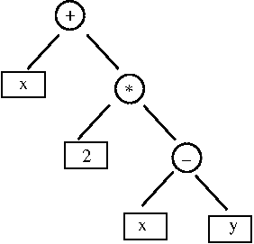

# Izračunavanje izraza u poljskoj notaciji


## Aritmetički izrazi


   
Svaki aritmetički izraz, kao što je na primjer
```   
x + 2*(x-y)
```    

možemo zapisati u formi binarnog stabla:




   
Stablo izraza _(expression tree_) je binarno stablo u kojem su listovi operandi, a 
operatori se nalaze u unutarnjim čvorovima. Za svaki binarni operator lijevo podstablo 
čini lijevi operand, a desno podstablo desni operand. Unarni operand ima samo jedno 
podstablo. Ako unarni operator pišemo ispred operanda (kao kod unarnog minusa), onda lijevo
podstablo ostaje prazno.  Ako unarni operator pišemo iza operanda (kao npr. faktorijel) onda
desno podstablo ostaje prazno.
   

   
Binarno stablo možemo obići na mnogo načina od kojih se ova tri najčešće koriste:
   

1. Preorder: KLD 
1. Inorder: LKD
1. Postorder: LDK

   
Ovdje KLD znači da se prvo obilazi korijen (K), zatim lijevo podstablo (L), a onda desno podstablo (D). 
Analogno se interpretiraju i drugi obilasci.  Na primjer, za naše stablo dobivamo:
   
1. Preorder:   ```+x*2-xy```
1. Inorder:     ```x+2*(x-y)```
1. Postorder:   ```x2xy-*+```
   
Vidimo da se u _preorder_ obilasku (notaciji) operator piše prije operanada, dok se u _postorder_ notaciji
piše poslije operanada. U _inorder_ notaciji operator dolazi između operanada i tada u zapisu moramo koristiti 
zagrade. U _preorder_ i _postorder_ notaciji zagrade nisu potrebne.
   


   
Preorder obilazak stabla izraza vodi na tzv. **poljsku notaciju** izraza (koju je uveo logičar Jan Łukasiewicz),
dok se postorder obilaskom dobiva tzv. _inverzna poljska notacija_. 
   

##    Izračunavanje izraza u poljskoj notaciji

   
Ovdje pretpostavljamo da svi operandi u izrazu zapisanom u poljskoj notaciji imaju
numeričke vrijednosti i želimo izračunati vrijednost izraza.
   
Izračunavanje izraza u poljskoj notaciji (preorder obilazak) je najprirodnije pomoću 
**rekurzivnog algoritma**. Prvi simbol u poljskoj notaciji je simbol operacije. Rekurzivna rutina za izračunavanje  
započinje čitanjem simbola operacije. 

- Ako je operacija unarna rutina poziva samu sebe da izračuna vrijednost 
operanda te zatim izvršava na njemu danu operaciju i vraća rezultat operacije. 
- Ako je operacija binarna 
rutina poziva samu sebe dva puta kako bi izračunala oba operanda i zatim izvršava opraciju te vraća 
izračunatu vrijednost. 

Rekurzivni poziv se završava kada je prvi pročitani simbol jednostavni 
operand. Tada funkcija samo vrati vrijednost operanda. 
     

   
Konstrurat ćemo klasu `Expression` koja izračunava izraz i čiji je kostur dan ovdje:
   

```cxx
/*  Klasa za izračunavanje aritmetičkog izraza u poljskoj notaciji.
 *  Binarne operacije su +,-,*,/,^ 
 *  Unarne operacije ~ (negacija). Koristimo ~ umjesto - kako bismo
 *  mogli razlikovati unarnu od binarne operacije prema simbolu.
 */
class Expression{
public:
   // tip izraza
   using Value =int;

   // tip tokena
   enum TokenType {operand, unaryOp, binaryOp};

   // pomoćna klasa koja predstavlja element izraza. Ako je izraz operand
   // imat će vrijednost. Ako se radi o operaciji vrijednost je nevažna.
   // Analogno je sa simbolom.
   struct Token{
        TokenType type() const;
        char symbol() const;
        Value value() const;
       // ... 
    };

   // Konstrukcija praznog izraza
    Expression() {}
   // Konstrukcija izraza iz stringa.
   // text mora sadržavati aritmetički izraz u poljskoj notaciji. Sprema
   // se u varijablu članicu mText.
    Expression(string text);
   // Izračunaj vrijednost izraza (rekurzivna metoda).  
    Value evaluate();
  private:
  // Daje sljedeći token sadržan u izrazu (i pomiće mNextToken).
    Token getToken();
};
```
 
 
Metoda `Expression::evaluate()` ima sljedeću strukturu:
 

```cxx
EXpression::Value Expression::evaluate(){
   Pročitaj token t it stringa mText;

   if(t.type() == unaryOp){
      Pozovi evaluate() da izračuna vrijednost operanda;
      Vrati vrijednost primjene operacije na operand;
   }
   else if(t.type() == binaryOp){
      Pozovi evaluate() da izračuna vrijednost prvog operanda;
      Pozovi evaluate() da izračuna vrijednost drugog operanda;
      Vrati vrijednost primjene operacije na operande;
   }
   else if(t.type() == operand){
      Vrati vrijednost operanda
   }
}
```
 
U slučaju greške (loše formiranog izraza) treba izbaciti `std::runtime_error` izuzetak.
 

 
Implemetirati sljedeće operatore. Binarni: +, -, *, /, ^ (potenciranje). Unarni `~` (negiranje).
Simbol za unarni minus je `~` kako ne bismo morali razlikovati unarni i binarni minus.
 

 
Testirati u glavnom programu s minimalno 3 (vlastita) testa. Na primjer,
 
```cxx
string expr = "~ * ^ 2 3 3 ";
Expression expr3(expr);
cout << expr  << " = "  << expr3.evaluate()  << endl;
```
 
daje izlaz:
 
```cxx
~ * ^ 2 3 3  = -24
```    
 
 

## Izračunavanje izraza u inverznoj poljskoj notaciji


   
Prirodno je izraz u poljskoj notaciji izračunavati rekurzivno stoga što operator u njemu
  prethodi operandima. Kada znamo operator znamo i koliko operanada treba dohvatiti te 
  znamo operaciju koju treba izvršiti. 
   

   
U inverznoj poljskoj notaciji operandi prethode operaciji i stoga nam nužne informacije nisu 
  poznate kod čitanja prvog tokena. U toj situaciji prirodnije je koristiti stog. Svaki operand 
  ubacujemo na stog. Kada dođemo do operacije uzimamo potreban broj operanada sa stoga, vršimo 
  operaciju i rezultat potisnemo na stog. Nakon posljednjeg tokena ostajemo samo s jednom 
  vrijednošću na stogu (ako je izraz bio ispravan) i to je vrijednost izraza.
   

   
Vi trebate formirati klasu `IPExpression`, sličnu klasi `Expression`, za izračunavanje izraza u inverznoj poljskoj notaciji.
Klasa treba tretirati iste operatore kao i klasa `Expression`. U main rutini formirajte barem 3 vlastita testa.
Na primjer, 
   
```cxx
string expr = " 3 2 4 * 1 - +";
IPExpression ipexp1(expr);
cout  << expr  << " = "  << ipexp1.evaluate()  << endl;
```
 
ispisuje:
 
```
 3 2 4 * 1 - + = 10
```


**Zadatak**. 

- Zadani su vam kosturi klasa  `Expression` i `IPExpression` koje izračunavaju izraz zapisan u poljskoj, odnosno 
inverznoj poljskoj notaciji (kroz metodu  `evaluate()`). Trebate dopuniti te klase u privatnom dijelu varijablama 
i (eventualno) metodama. Javni dio tih klasa ne treba proširivati.
- Implementirati metode  klasa  `Expression` i `IPExpression` u datotekama `evaluate_prefix.cpp` i 
   `evaluate_postfix.cpp`. Svoje testove napisati u funkciji `main`, barem 3 test za poljsku i 3 za inverznu poljsku
   notaciju.
- Testovi u `test` direktoriju moraju proći. Testovi se izvode u `build` direktoriju sa `ctest -V`.


**Napomene**. 

- Konstruktori klasa  `Expression` i `IPExpression` uzimaju izraze u  poljskoj, odnosno 
inverznoj poljskoj notaciji što znači da za dani izraz konverziju u traženu formu morate sami učiniti (ručno). 
- Važna je konstrukcija funkcije `getToken()` koju zove jedino `evaluate()` te je stoga privatna. 
- U ovom se repozitoriju *googletest* dovlači sa GitHub-a i kompilira kao dio projekta. Stoga, nakon što se
repozitorij lokalno klonira treba u njemu izvršiti dvije narede: `git submodule init` i `git submodule update`.
To će dovući čitav googletest. 
